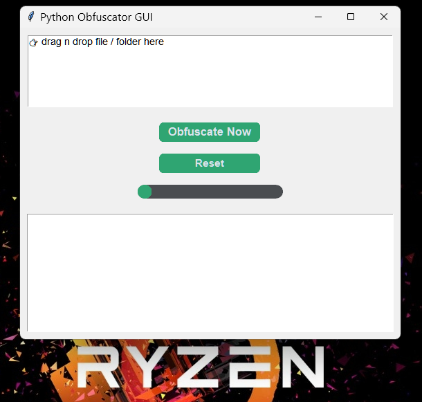

<div align="center">
  <h1>🛡️ Obfuskit</h1>
  <p><strong>Python Obfuscator GUI – Protect Your Source Code with One Click</strong></p>
  
  <p>
    
    
    
    
  </p>
  
  <p>
    
    
    
  </p>
</div>

---

## ✨ Features

| Feature | Description |
|---------|-------------|
| 🚀 **Drag & Drop** | Add Python files/folders directly to GUI |
| 📊 **Progress Bar** | Monitor obfuscation progress in real-time |
| 🧾 **Log Box** | Detailed status with timestamps |
| 🔄 **Reset Button** | Clear file list without restarting |
| 🔒 **Base64 Encoding** | Convert Python code to encrypted format |
| ⚙️ **Portable EXE** | Run without Python installation |
| 🎨 **Modern UI** | Built with CustomTkinter |

---

## 🖼️ Screenshots

<div align="center">
  
  <br />
  <em>Python Obfuscator GUI</em>
</div>

---


## 🚀 Quick Start

### Prerequisites

- **Python 3.12+** (for development)
- **No Python required** for end users (if using EXE)

### Installation

#### 1. Clone the Repository

```bash
git clone https://github.com/b70386/obfuskit.git
cd obfuskit
```

#### 2. Install Dependencies

```bash
pip install -r requirements.txt
```

#### 3. Run as Python Script

```bash
python obfuskit.py
```

#### 4. Build to EXE (Optional)

```bash
pip install pyinstaller
python -m PyInstaller --onefile --noconsole obfuskit.py --hidden-import=customtkinter --hidden-import=tkinterdnd2 --hidden-import=darkdetect
```

The `.exe` will be available in the `dist/` folder.


## 🛠️ Configuration
```
Requirements.txt

customtkinter==5.2.2
tkinterdnd2
darkdetect==0.8.0
packaging

Obfuscation Method
Obfuskit uses Base64 encoding to protect Python source code:
Encodes .py files to Base64
Wraps them with exec() decoder
Maintains original file names
```

## 📁 Project Structure
```
obfuskit/
├── obfuskit.py          		 # Main application
├── requirements.txt      	# Python dependencies
├── icon.png              		# Application icon
├── README.md             # This file
└── LICENSE              		 # MIT License
```

## 🎯 Roadmap

- [x] Drag & Drop support
- [x] Progress bar with real-time updates
- [x] Log box with timestamps
- [x] Reset button
- [x] Batch file processing
- [x] Portable EXE build
- [ ] Preserve comments option
- [ ] Rename variables obfuscation
- [ ] Multi-language support

---

## 🤝 Contributing

Contributions are welcome! Feel free to:

1. Fork the repository
2. Create a feature branch (`git checkout -b feature/amazing`)
3. Commit your changes (`git commit -m 'Add amazing feature'`)
4. Push to the branch (`git push origin feature/amazing`)
5. Open a Pull Request

---

## 📝 License

This project is licensed under the **MIT License** – see the [LICENSE](LICENSE) file for details.

---

## ⚠️ Disclaimer

> **For Educational and Protection Purposes Only**  
> Obfuskit is designed to protect your own source code during distribution.  
> It is **not** intended for malicious use or bypassing license restrictions.  
> Users are responsible for complying with applicable laws and regulations.

---

## 🙏 Acknowledgments

- [CustomTkinter](https://github.com/TomSchimansky/CustomTkinter) – Modern GUI framework
- [TkinterDnD2](https://github.com/RedFantom/tkinterdnd2) – Drag & drop functionality
- [PyInstaller](https://pyinstaller.org) – Packaging Python apps
- [Darkdetect](https://github.com/albertosottile/darkdetect) – System theme detection

---

## Trademarks

All trademarks, service marks, trade names, logos, and other identifiers of source 
("Trademarks") used in this software are the property of their respective owners. 
The use of any Trademark in this software does not imply any endorsement, sponsorship, 
or affiliation with the Trademark owner unless otherwise stated.

The names of the project, its contributors, and its maintainers may not be used to 
endorse or promote products derived from this software without specific prior written 
permission.

<div align="center"> <p>Made with 🛡️ for Python Developer Protection</p> <p> <a href="https://github.com/b70386/obfuskit/issues">Report Bug</a> • <a href="https://github.com/b70386/obfuskit/issues">Request Feature</a> </p> </div> ```


📌 Catatan
Aspek	Keterangan
Repo URL	https://github.com/b70386/obfuskit
Tech Stack	Python, CustomTkinter, TkinterDnD2, PyInstaller
Fungsi Utama	Obfuscate file/folder Python dengan Base64
Lisensi	MIT